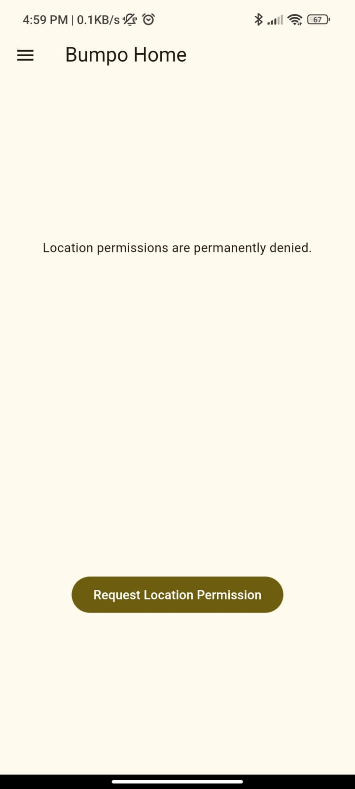
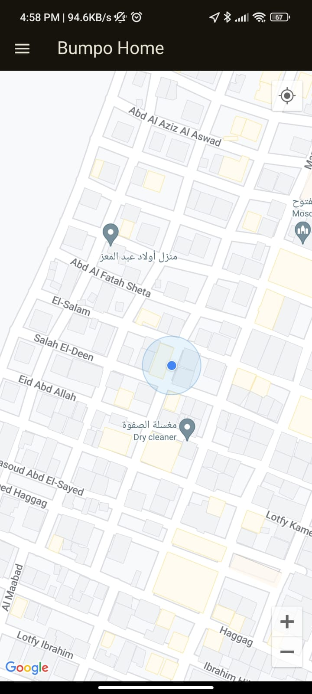
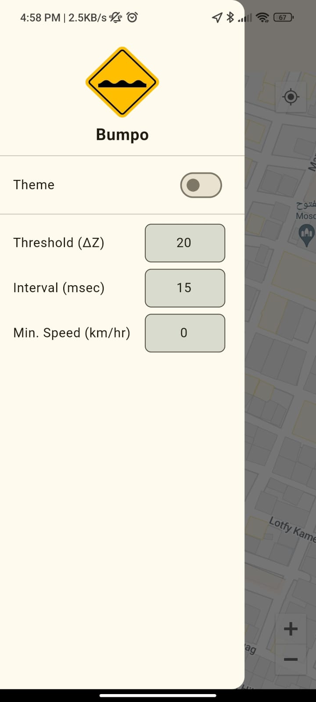
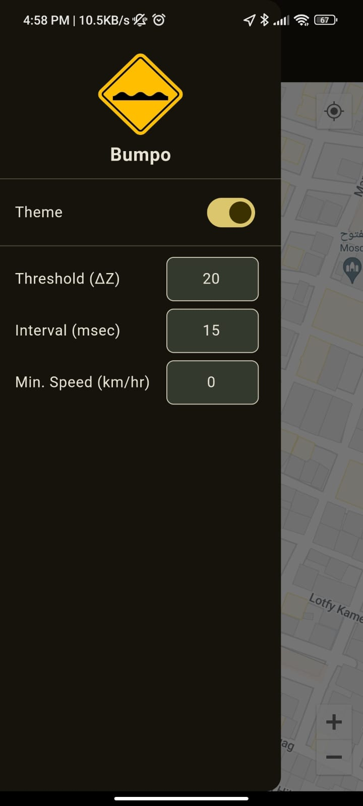

# Bumpo

Bumpo is a lightweight Flutter application designed to register bumps on the road and notify the user when they are driving near one. The bumps are displayed on a Google Map with live location tracking. The app also provides customizable controls for threshold settings, minimum speed to register a bump, and sample time in milliseconds. Bumpo features both light and dark themes for an enhanced user experience.

## Features

- Register live bumps while driving.
- Notify the user with a beep sound when approaching a bump.
- Display bumps on a Google Map with live location tracking.
- Customizable threshold, minimum speed, and sample time settings.
- Light and dark themes.

## Technologies Used

- [Flutter](https://flutter.dev/)
- [Hive](https://pub.dev/packages/hive): ^2.2.3
- [Hive Flutter](https://pub.dev/packages/hive_flutter): ^1.1.0
- [Google Maps Flutter](https://pub.dev/packages/google_maps_flutter): ^2.6.1
- [Bloc](https://pub.dev/packages/bloc): ^8.1.4
- [Flutter Bloc](https://pub.dev/packages/flutter_bloc): ^8.1.5
- [Firebase Core](https://pub.dev/packages/firebase_core): ^2.32.0
- [Geolocator](https://pub.dev/packages/geolocator): ^12.0.0
- [Build Runner](https://pub.dev/packages/build_runner): ^2.4.10
- [Sensors Plus](https://pub.dev/packages/sensors_plus): ^5.0.1
- [Cloud Firestore](https://pub.dev/packages/cloud_firestore): ^4.17.5
- [Audioplayers](https://pub.dev/packages/audioplayers): ^6.0.0
- [Flutter Launcher Icons](https://pub.dev/packages/flutter_launcher_icons): ^0.13.1

## Installation

To install the app, download and install the APK file on your Android device. Ensure you have allowed installations from unknown sources in your device settings.

## Usage

1. Open the app and grant location permissions.
2. Drive your car and listen for beeps when approaching a bump.
3. Use the settings menu to adjust the bump threshold (ΔZ), sample interval (ms), and minimum speed (km/hr).

## Screenshots

*Bumpo Home Screen with Location Permissions Denied*

*Bumpo Map Display with Live Location Tracking*

*Bumpo Settings Menu (Light Mode)*

*Bumpo Settings Menu (Dark Mode)*

## License

This is a personal project and does not include a license. Please contact me for permissions or inquiries.

## Contact

- Email: ibrahimnasser07@gmail.com
- Phone: +0201094633775